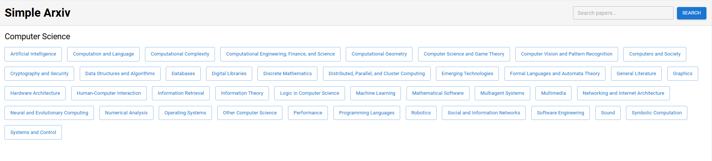
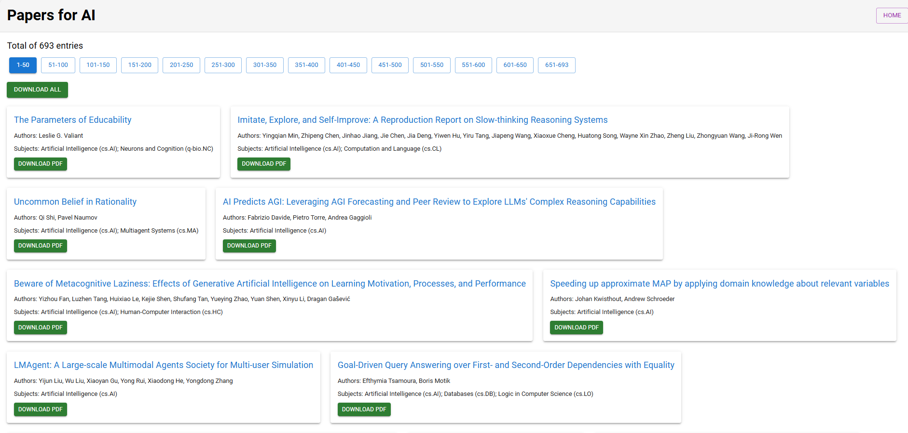

# ArXiv Downloader

**ArXiv Downloader** is a simple and efficient tool to fetch, browse, and download research papers from [arXiv](https://arxiv.org/). The project includes a FastAPI backend and a React frontend, allowing users to download individual papers or entire collections in a ZIP file.

The application does not rely on the official arXiv API for fetching the latest papers, as the API does not always provide the most recent updates. Instead, it directly scrapes the arXiv website to retrieve the latest information.

---

## Features

- Browse papers by category (currently focused on Computer Science).
- Search for specific papers using keywords.
- Download individual papers or multiple papers as a ZIP file.
- Easily extend categories or functionalities in the frontend code.

---

## Project Structure

```plaintext
papers/
├── backend/           # FastAPI backend
├── frontend/          # React frontend with Material-UI
└── docker-compose.yml # Docker Compose for containerized deployment
```

---

## Quick Start

### Option 1: Run with Docker Compose

1. Ensure you have [Docker](https://www.docker.com/) and [Docker Compose](https://docs.docker.com/compose/) installed.
2. Clone the repository:
   ```bash
   git clone https://github.com/sky4689524/arxiv-downloader.git
   cd arxiv-downloader
   ```
3. Start the application:
   ```bash
   docker-compose up --build
   ```
4. Open your browser and navigate to `http://localhost:3000`.

---

### Option 2: Run Locally Without Docker

#### Step 1: Backend

1. Navigate to the `backend` directory:
   ```bash
   cd backend
   ```
2. Install dependencies (preferably in a virtual environment):
   ```bash
   pip install -r requirements.txt
   ```
3. Start the backend server:
   ```bash
   uvicorn main:app --reload
   ```
   The backend will be available at `http://localhost:8000`.

#### Step 2: Frontend

1. Navigate to the `frontend` directory:
   ```bash
   cd frontend
   ```
2. Install dependencies:
   ```bash
   npm install
   ```
3. Start the frontend:
   ```bash
   npm start
   ```
   The frontend will be available at `http://localhost:3000`.

---

## Screenshots

### 1. Home Page

The homepage displays categories (currently focused on Computer Science). You can modify categories in `frontend/components/CategoryList.js`.



---

### 2. Category Page

The category page displays a list of papers for a selected category. You can download individual papers or all papers as a ZIP file.



---

## How to Customize

### Modify Categories

To change or add categories:

1. Open `frontend/components/CategoryList.js`.
2. Edit or add new categories in the list.

---

## Contributing

Contributions are welcome! If you’d like to add features or fix issues, feel free to fork the repository and submit a pull request.

This project serves as a simple example of how to scrape arXiv and provide an easy way to download papers in PDF format. It is intended to be a helpful tool for those who want to access research papers conveniently.

There are many ways to improve the project:

- Add support for more categories.
- Enhance the user interface for better usability.
- Optimize scraping logic to improve efficiency and reliability.
- Add features like bookmarks, saved searches, or notifications for new papers.

We encourage contributions of all kinds to make this project better for everyone!

---

## License

This project is licensed under the [MIT License](LICENSE).
